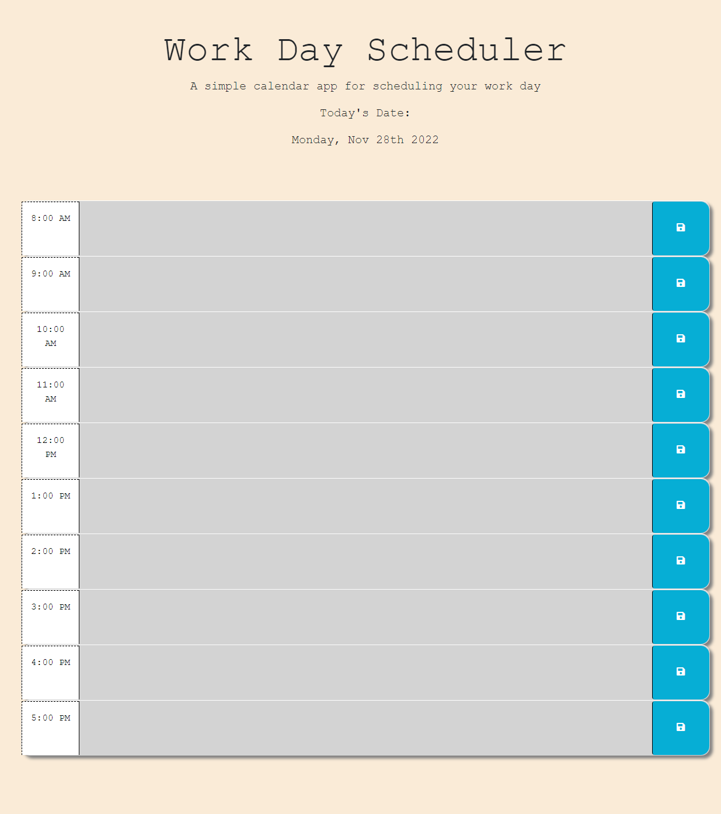

# workday-scheduler

## Description

This page is a workday scheduler that will help you plan out your workday with color coding that shows you where you are at in the day. This will make it easier to know how much time you have left at work and fill out your schedule.


## Installation

You just need a device with internet access and a browser to use this page.

## Usage

Go to the hour in the day that you want to schedule an activity and click save. Your scheduled activities will stay - even if you refresh the page!

Site Link: https://willj30.github.io/workday-scheduler/ 

Screenshot:


    ```

## License

MIT License

---